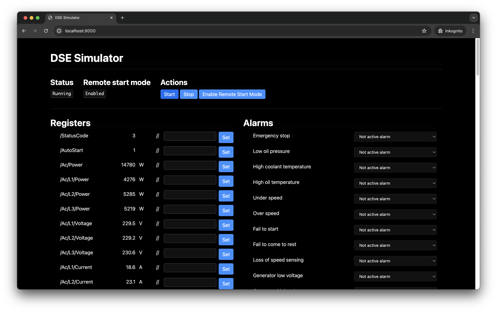

# DSE Modbus Simulator

This repository contains a Python script simulating the Modbus TCP server of a generator equipped with a DSE 4620 controller + DSE 855 "USB to Ethernet Communications Device".

## Features

**Modbus:**
* Telemetry Start/Stop
* Setting into Remote start mode
* Power production value simulation (randomized)
* Alerts

**Web interface:**
* Read and set register values
* Set via web interface



## Get started

Follow these steps to run the simulator on your machine:

```sh
# Install virtualenv
pip3 install virtualenv

# Create venv
python3 -m venv venv

# Activate venv
source venv/bin/activate

# Install dependencies
pip install -r requirements.txt

# Run Webserver at http://localhost:8000 and Modbus server on 0.0.0.0:502
python3 main.py
```

After that, you can enter your machine's IP address on the GX device at *Settings* > *Modbus TCP/UDP devices* > *Saved Devices* via the **Add** button. Use `TCP`, port `502` and unit id `1`. After that, the simulated generator should show up in the Device list.